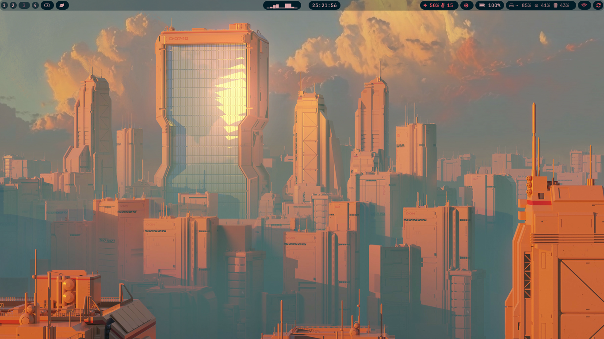
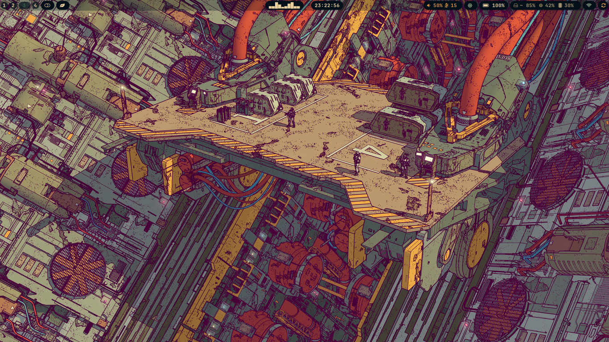

> [!CAUTION]
> Requires [pywal](https://github.com/dylanaraps/pywal) to work

## Config Details

-   OS: Arch Linux
-   DE/WM: Hyprland
-   Shell: zsh
-   Terminla emulator: Kitty
-   Text editor: nvim
-   App launcher: rofi
-   Top bar: waybar
-   Screen locker: swaylock effects
-   Wallpaper select : swww
-   Browser: Firefox
-   Colorscheme generation utility: pywal

# Screenshots

Waybar

## Dependencies

-   status bar: [waybar](https://github.com/Alexays/Waybar)
-   notification daemon & control center: [swaync](https://github.com/ErikReider/SwayNotificationCenter)
-   audio visualizer: [cava](https://github.com/karlstav/cava)
-   music player (TUI): mpd & ncmpcpp
-   file manager (TUI): [ranger](https://google.com)
-   file manager (GUI): dolphin and thunar
-   screenshot helper: [grimblast](https://github.com/hyprwm/contrib/tree/main/grimblast) (do `grimblast check` to see if its dependencies are satisfied)
-   [wlogout](https://github.com/ArtsyMacaw/wlogout)
-   [hyprpaper](https://github.com/hyprwm/hyprpaper)
-   [hypridle](https://github.com/hyprwm/hypridle)
-   [hyprlock](https://github.com/hyprwm/hyprlock)
